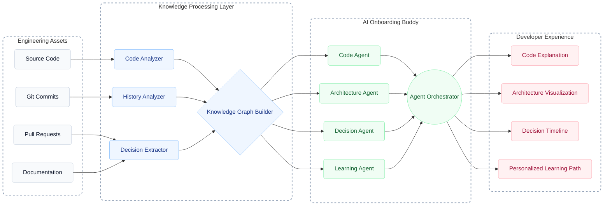

# 🚀 AI Onboarding Buddy

> An intelligent multi-agent system that accelerates developer onboarding by turning stale documentation, scattered code, and buried PRs into a living, interactive knowledge graph.

---

## 📊 Detailed Analysis (Use Case Validation)

### 🚨 The Problem
Onboarding new engineers onto large or legacy codebases is painfully slow. Documentation is often stale, and the critical "why" behind technical decisions is buried in Slack messages, Jira tickets, or closed Pull Requests. New hires spend weeks reading code blindly, constantly interrupting senior engineers to understand the system's architecture and history.

### 👥 Who Has It?
- **New Software Engineers:** Frustrated by the steep learning curve and lack of context.
- **Senior Engineers/Tech Leads:** Constantly interrupted to answer basic questions or explain historical context.
- **Engineering Managers / VPs of Engineering:** Concerned about time-to-productivity and high onboarding costs.

### 📈 Evidence the Pain is Real
- Industry surveys indicate it takes a new engineer **3 to 6 months** to become fully productive in a complex enterprise codebase.
- "Tribal knowledge" acts as a massive bottleneck, slowing down feature delivery when key personnel are unavailable.

### 💰 Who Pays?
- **VP of Engineering** or **CTO**, drawing from the developer productivity, tooling, or engineering training budgets. The ROI is measured in months of saved engineering hours.

### 🛠️ Existing Alternatives
- **Static Wikis (Confluence, Notion):** Quickly become outdated and rarely reflect the current state of the code.
- **Pair Programming / Mentoring:** Highly effective but extremely expensive and unscalable as it drains senior engineering time.
- **Standard AI Coding Assistants (Copilot):** Great at writing localized code, but lack deep, architectural context and historical awareness (the "why").

### 🗺️ Scoped MVP Plan
1. **Data Ingestion:** Connect to a GitHub repository to fetch Source Code, Commit History, and Pull Requests.
2. **Knowledge Extraction:** Run the `Code Analyzer` and `Decision Extractor` over a limited subset of the codebase (e.g., just the Auth or Payment module).
3. **Graph Construction:** Build a basic Knowledge Graph linking code to the PRs that introduced them.
4. **Interactive Chat:** Provide a simple CLI or Web interface (`Agent Orchestrator`) that successfully answers structural ("Where is X?") and historical ("Why did we do Y?") questions.

---

## 🧠 System Architecture

The AI Onboarding Buddy relies on a robust multi-agent architecture designed to process engineering assets and synthesize them into a cohesive knowledge graph.

---

## 🏗️ Block-by-Block Explanation

### 1. Engineering Assets (Inputs)
The raw data foundation of the system.
- **Source Code:** Functions, Classes, APIs, Services, Modules. (Purpose: Understand what the system does. *e.g., Where is login implemented?*)
- **Git Commits:** Feature additions, bug fixes, refactoring. (Purpose: Understand when and how the system evolved. *e.g., When was JWT introduced?*)
- **Pull Requests:** Code reviews, engineering discussions, tradeoffs, approvals. (Purpose: Understand why decisions were made. *e.g., Why did the team move from sessions to JWT?*)
- **Documentation:** READMEs, Wikis, Architecture Docs. (Purpose: Provide high-level project understanding.)

### 2. Knowledge Processing Layer
This layer converts raw engineering data into AI-understandable knowledge.
- **Code Analyzer:** Analyzes classes, functions, and API flows to build a structural understanding (e.g., `Auth Service -> Login Function`).
- **History Analyzer:** Tracks feature evolution over time (e.g., `v1 Password Login -> v2 JWT Login`).
- **Decision Extractor:** Mines PR comments and reviews to capture engineering knowledge (e.g., *Why Kafka? Why Redis?*).
- **Knowledge Graph Builder 🌟 (Innovation Block):** Connects everything together. Without this, the AI only searches text. With this, it reasons.
  - *Example Relationship:* `Auth Service` -> `introduced_by` -> `PR #124` -> `approved_by` -> `Tech Lead`.

### 3. AI Onboarding Buddy (Intelligence Layer)
The actual intelligence layer comprising specialized sub-agents.
- **Code Agent:** Locates files, functions, and services. (*"Where is authentication implemented?"*)
- **Architecture Agent:** Explains component communication and request flows. (*"How does a login request flow?" -> Frontend -> Gateway -> Auth Service -> DB*)
- **Decision Agent 🎯 (The Judge-Attracting Feature):** Surfaces historical discussions and outcomes. (*"Why was Redis chosen?" -> Returns PR discussion, decision, and result.*)
- **Learning Agent:** Creates personalized onboarding schedules. (*"How should I learn this codebase?" -> Day 1: APIs, Day 2: Auth...*)
- **Agent Orchestrator:** Acts as the central manager. Combines responses from all relevant agents to answer complex user queries.

### 4. Developer Experience (Outputs)
The tangible deliverables provided to the user.
- **Code Explanation:** What does this service do?
- **Architecture Visualization:** How do components communicate?
- **Decision Timeline:** Why was this design chosen? *(e.g., 2023 → Sessions [High DB Load] | 2024 → Redis [5x Faster])*
- **Personalized Learning Path:** An automatically generated schedule to learn the codebase efficiently in a set number of days.