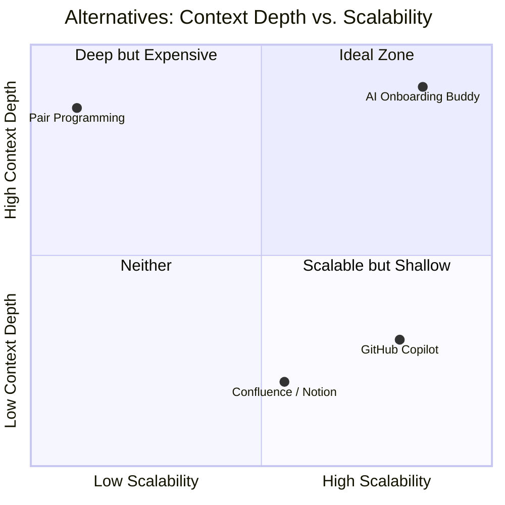
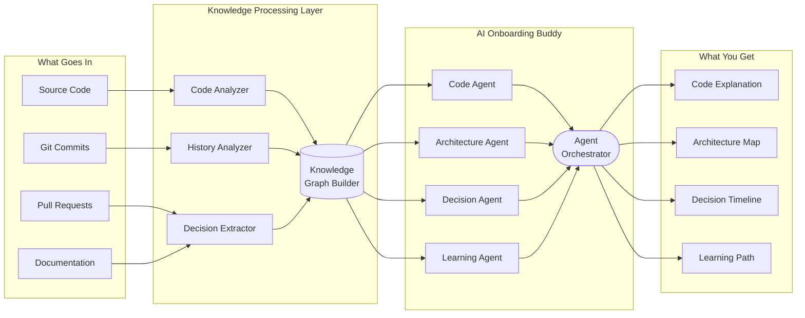
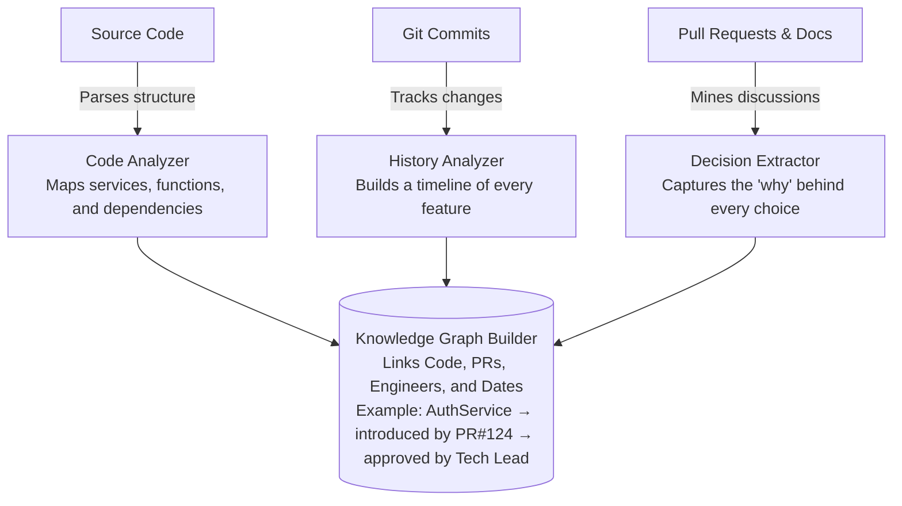
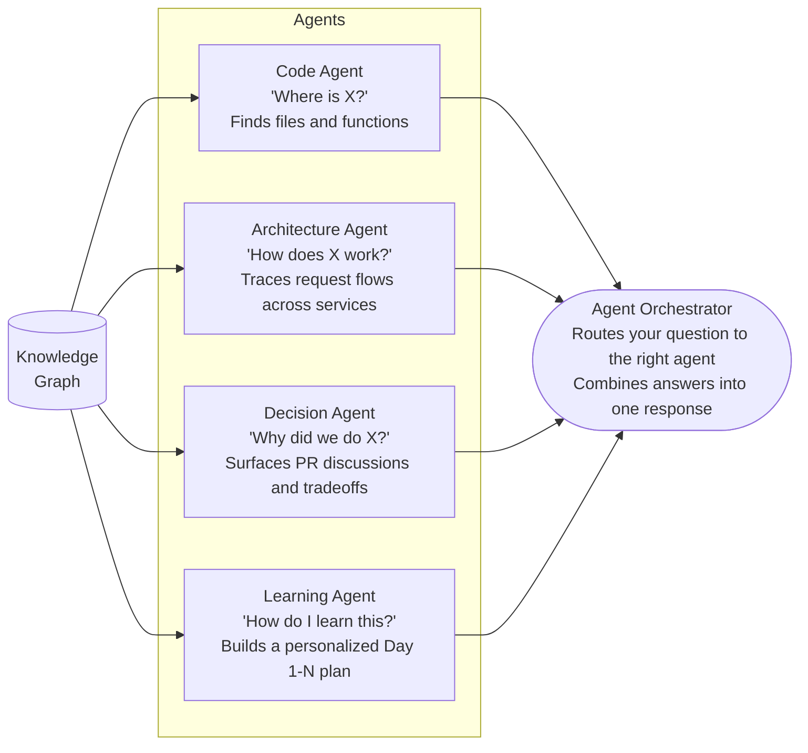
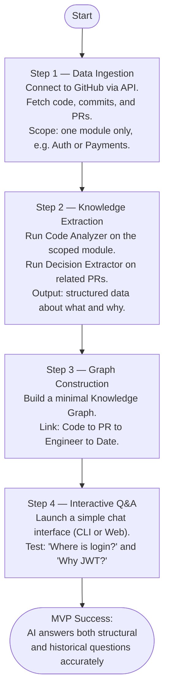

# AI Onboarding Buddy

> Turn months of confusion into days of clarity.  
> A multi-agent AI system that connects to your GitHub repo and answers any question about your codebase — what it does, when it changed, and why decisions were made.

---

## Table of Contents

1. [The Problem](#the-problem)
2. [Who Has It?](#who-has-this-problem)
3. [Evidence the Pain is Real](#evidence-the-pain-is-real)
4. [Who Pays?](#who-pays)
5. [Existing Alternatives](#existing-alternatives)
6. [Our Solution](#our-solution)
7. [How It Works](#how-it-works--agent-architecture)
8. [MVP Plan](#scoped-mvp-plan)

---

## The Problem

Your first week at a new company. You need to fix a bug. Simple enough — except:

- Where is authentication implemented?
- Why are we using JWT instead of sessions?
- Is this README even up to date?

You spend hours reading code that makes no sense without context. You interrupt a senior engineer — again.

This is the **onboarding knowledge gap.** The "why" behind every technical decision is buried in closed PRs, old Slack threads, and the heads of people too busy to explain it.

---

## Who Has This Problem?

| Person | Their Pain |
|---|---|
| New Engineer | Weeks of confusion that a 5-minute conversation could fix |
| Senior Engineer | Interrupted 10+ times a day to explain things that should be documented |
| Engineering Manager | Every new hire costs 3-6 months of lost productivity |

---

## Evidence the Pain is Real

- A new engineer takes **3 to 6 months** to become productive in a large codebase.
- "Tribal knowledge" — critical context that lives only in people's heads — causes delays every time a key person is unavailable or leaves.
- Recovering that context is expensive, slow, and often incomplete.

---

## Who Pays?

**VP of Engineering or CTO**, drawing from developer productivity or tooling budgets.

The ROI is direct: fewer interruptions to senior engineers, faster ramp-up per hire, and measurable cost savings. For a company hiring 20 engineers a year, shaving 30 days off onboarding recovers hundreds of thousands of dollars in engineering output.

---

## Existing Alternatives

| Alternative | What It Does | Why It Falls Short |
|---|---|---|
| Confluence / Notion | Stores documentation | Goes stale, never reflects actual code |
| Pair Programming | Rich knowledge transfer | Doesn't scale, drains senior engineers |
| GitHub Copilot / Cursor | Autocomplete and local code help | No architectural awareness, can't answer "why" |

None of them can answer *"Why was Redis chosen over Memcached in 2023?"* — because that answer lives in a closed PR nobody bookmarked. We can.

---

## Our Solution

AI Onboarding Buddy reads your GitHub repo — code, commits, and PRs — and builds a knowledge graph that maps what your system does, when it changed, and why decisions were made. New engineers ask questions in plain English and get answers grounded in your actual history.

> *"Why are we using JWT?"*
> PR #124: "Sessions caused DB overload at 10k users. JWT reduced latency by 5x. Approved by tech lead, Mar 2023."

---

## How It Works — Agent Architecture

The system runs in 4 layers. Raw data goes in, useful answers come out.

### Overview

---

### Layer 1 — What Goes In

We don't ask you to write anything new. We read what already exists.

| Asset | What It Tells Us |
|---|---|
| Source Code | What the system does — functions, services, APIs |
| Git Commits | When things changed and how the system evolved |
| Pull Requests | Why decisions were made — the most valuable, most ignored source |
| Docs / READMEs | High-level project context |

---

### Layer 2 — Knowledge Processing

This layer converts raw files into structured knowledge.

The **Knowledge Graph Builder** is the core innovation. Without it, AI just searches text. With it, AI understands relationships — between code, decisions, and people.

---

### Layer 3 — The Agents

Four specialized agents use the knowledge graph to answer different types of questions.

The **Decision Agent** is the standout feature — the only one that can answer "why" by surfacing actual engineering discussions from your PR history, not just the resulting code.

---

### Layer 4 — What You Get

| Output | Example |
|---|---|
| Code Explanation | "Auth Service handles login, token refresh, and logout using JWT in HttpOnly cookies." |
| Architecture Map | Login → API Gateway → Auth Service → User DB → Return JWT |
| Decision Timeline | 2022: Sessions (slow) → 2023: Redis (5x faster) → 2024: JWT (stateless) |
| Learning Path | Day 1: APIs & Auth · Day 2: Payment Flow · Day 3: Data Pipeline |

---

## Scoped MVP Plan

The MVP answers one question: *Can an AI answer structural and historical questions about a real codebase, accurately, in plain English?*

### What's Out of Scope for MVP

- Full codebase indexing (start with 1 module)
- Jira, Slack, or Confluence integration
- Personalized learning paths
- Architecture visualizations

Ship the core value first. Expand from there.

---

## Tech Stack (Planned)

| Layer | Tools |
|---|---|
| Data Ingestion | GitHub REST / GraphQL API |
| Knowledge Extraction | LLMs (GPT-4 / Claude) + AST parsers |
| Graph Storage | Neo4j / LlamaIndex |
| Agent Orchestration | LangGraph / CrewAI |
| Interface | FastAPI + React (or CLI for MVP) |

---
